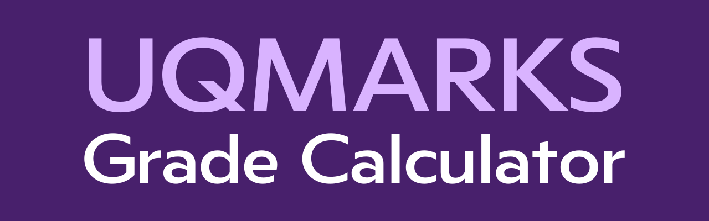

A grade calculator specifically designed for UQ. 
Currently hosted on https://www.uqmarks.com/

### Features:
* Weekly Quiz Calculator
	> Calculate grade if only the best *X* quizzes count towards the grade.
* Grade Calculator for Course/Subject
	>Calculate required marks to get a certain grade

Developed with the **Flask Framework (Python)** and **SQLite**.

Inspired by [uqfinal](https://uqfinal.com/). 

### Installation
1. (Optional) Create a discord channel (or two) for logging. 
   - One for error logs, one for normal.
2. Create a `.env` file in the root directory with the following variables:
```
SECRET_KEY - secret key for Flask
LOG_LINK - Discord webhook link for normal logging
ERROR_LOG_LINK - Discord webhook link for error logging
MANAGER_ID - a Discord User ID (18 digit number) for error logs. The message will mention the user. (e.g. <@[ID]>)
DEBUG_MODE - T/F , if you want to run Flask in DEBUG mode
ENABLE_LOGGING - T/F , if you want to enable logging of operations
```

### Starting The App:
**Note the application is written and hosted in Python 3.10. It must be run in 3.10+**
1. Change settings in `config.py` as necessary
   - DEBUG_MODE - Set to True if you want Flask to run in debug mode.
   - ENABLE_LOGGING - Set to True if you want to send logging requests
      - If false, LOG_LINK and ERROR_LOG_LINK env variables won't matter.

2. Run `app.py`
3. Open a new terminal:
```
cd react-app
npm run dev
```
